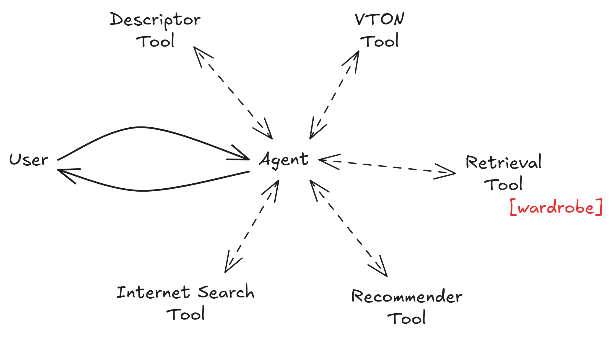

# Fashion Recommender Agent

An AI-powered conversational fashion recommendation system with visual search, virtual try-on, and internet search capabilities. Built with multi-tool calling agent architecture, multimodal RAG, and modern web technologies.


## Key Features

- 🤖 **Agent with Multi Tool Calling System** - Intelligent fashion recommendations using a multi-tool calling system
- 🎨 **Multimodal RAG** - Multimodal Retrieval-Augmented Generation to retrieve fashion items from local database
- 👗 **Virtual Try-On** - Upload your photo and visualize fashion items on yourself
- 🌐 **Internet Search** - Search the internet for fashion items
- 💬 **Conversational Interface** - Natural language interaction with session management
- 📊 **Prompt Management** - Versioned prompts with LangSmith for observability and iteration



## Tech Stack

- **Backend:** FastAPI, Python 3.12+, Uvicorn
- **Frontend:** Next.js, TypeScript
- **AI/ML:** LangChain, LangGraph, LangSmith, OpenAI, LiteLLM
- **Vector Database:** Qdrant
- **Image Processing:** CLIP (fashion-clip), Transformers, PyTorch (CUDA 12.8)
- **Package Management:** uv

## Architecture Overview

The system uses a **multi-tool calling agent architecture** where specialized tools handle different aspects of fashion recommendations:

- **Agent:** Main orchestrator that routes user queries to appropriate specialized tools
- **Descriptor:** Analyzes fashion images and extracts visual features and descriptions
- **Recommender:** Provides fashion recommendations based on user's intention
- **Retrieval:** Retrieves fashion items from local database (wardrobe)
- **Search:** Searches the internet for fashion items
- **VTON (Virtual Try-On):** Creates virtual try-on images using user-uploaded photos

The backend uses:
- **Qdrant** vector database for efficient similarity search
- **LangSmith** for prompt versioning and management, tracing, and observability
- **LiteLLM** for LLM API Calls
- **Instructor** and **Pydantic** for structured output
- **FastAPI** for REST API endpoints
- **Next.js** frontend for user interface

## Prerequisites

- Python 3.12 or higher
- Node.js and npm
- Docker and Docker Compose
- CUDA-capable GPU (optional, recommended for faster inference)
- API Keys:
  - OpenAI API key
  - Google API key
  - LangSmith API key

## Installation

1. **Clone the repository**
```bash
git clone <repository-url>
cd fashion_recommender
```

2. **Install uv (Python package manager)**
```bash
curl -LsSf https://astral.sh/uv/install.sh | sh
```

3. **Install Python dependencies**
```bash
uv sync
```

4. **Install frontend dependencies**
```bash
cd src/frontend
npm install
cd ../..
```

5. **Set up environment variables**

Rename the `.env.example` file to `.env`:
```bash
mv .env.example .env
```

Set the API keys in the `.env` file.

For more details:
* [LangSmith API Key](https://docs.langchain.com/langsmith/create-account-api-key)
* [Google API Key](https://aistudio.google.com/app/api-keys)
* [OpenAI API Key](https://platform.openai.com/account/api-keys)

## Quick Start

0. **Create a Qdrant collection**

We recommend creating a Qdrant collection first before running anything. This collection acts as your local database (wardrobe) where you can query your own fashion items. However, as the development is still in progress, you can use the sample collection provided in the `data/ctl/sample_5.jsonl` file and run the following command to create the collection:
```bash
docker compose up -d && \
uv run python utils/create_collection_ctl.py 
```

1. **Start the backend**
```bash
make start-backend
```
This starts Qdrant (if not already running) and the FastAPI server on `http://localhost:8000`

2. **Start the frontend** (in a new terminal)
```bash
make start-frontend
```
This starts the Next.js development server on `http://localhost:3000`

3. **Access the application**
Open your browser and navigate to `http://localhost:3000`

## Project Structure

```
fashion_recommender/
├── src/
│   ├── backend/              # FastAPI application
│   │   └── app/
│   │       ├── api/          # API route handlers
│   │       ├── services/     # Business logic and agent services
│   │       ├── models/       # Pydantic models
│   │       ├── utils/        # Helper functions
│   │       ├── main.py       # FastAPI app entry point
│   │       └── prompt_manager.py  # LangSmith prompt management
│   └── frontend/             # Next.js application
├── utils/                    # Utility scripts
│   ├── push_prompt.py        # Push prompts to LangSmith
│   └── create_collection_ctl.py  # Create Qdrant collections
├── prompts/                  # Prompt templates (YAML)
│   ├── agent.yaml
│   ├── descriptor.yaml
│   ├── recommender.yaml
│   └── vton.yaml
├── examples/                 # API usage examples
│   └── backend/
├── data/                     # Fashion data
├── docker-compose.yml        # Qdrant service definition
├── Makefile                  # Convenience commands
└── pyproject.toml            # Python dependencies
```


## Acknowledgments

- [fashion-clip](https://huggingface.co/patrickjohncyh/fashion-clip) - Fine-tuned CLIP model for fashion domain
- [LangChain](https://github.com/langchain-ai/langchain) - LLM application framework
- [Qdrant](https://qdrant.tech/) - Vector similarity search engine
- [FastAPI](https://fastapi.tiangolo.com/) - Modern Python web framework
- [Next.js](https://nextjs.org/) - React framework for web applications
- [CTL Dataset](https://github.com/eileenforwhat/complete-the-look-dataset) - Complete The Look (CTL) dataset

---